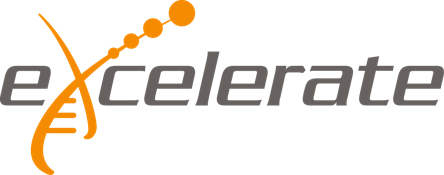

# [Schedule](schedule.md)
-------------

## About

This international hands-on course covers several aspects of single cell RNA-seq data analysis, ranging from clustering and differential gene expression analysis to trajectories, cell type identification and spatial transcriptomics. The course is kindly sponsored by the ELIXIR EXCELERATE project.

### Date
27-05-2019 - 29.05.2019

### Location
The event is organised at the CSC Training Facilities located in the premises of CSC at Keilaranta 14, Espoo, Finland. The best way to reach us is by public transportation; more detailed travel tips are available [here](https://www.csc.fi/how-to-reach-us).

### Prerequisities
In order to participate in this course you should have prior experience in using R.

### Learning objectives
After this course you will be able to:
- use a range of bioinformatics tools to analyze single cell RNA-seq data
- discuss a variety of aspects of single cell RNA-seq data analysis
- understand the advantages and limitations of single cell RNA-seq data analysis

## Programme
### Monday 27.5.2019

- Introduction and experimental design (Åsa Björklund)
- QC, data preprocessing (Åsa Björklund)
- Normalisation and batch effect correction (Heli Pessa, Ahmed Mahfouz)

### Tuesday 28.5.2019
- Dimensionality reduction (PCA, tSNE and UMAP) (Paulo Czarnewski)
- Clustering and visualisation (Ahmed Mahfouz)
- Differential gene expression analysis (Ståle Nygård and Olga Dethlefsen)

### Wednesday 29.5.2019
- Cell type identification (Philip Lijnzaad)
- Trajectories/Pseudo-time (Paulo Czarnewski)
- Spatial transcriptomics (Jeongbin Park and Lars Borm)
- Integration of data, e.g. CITE-Seq (Ahmed Mahfouz)

### Lecturers
- Åsa Björklund (SciLifeLab, NBIS, Sweden)
- Paulo Czarnewski (SciLifeLab, NBIS, Sweden)
- Ahmed Mahfouz (LUMC, Netherlands)
- Ståle Nygård (UIO, Norway)
- Olga Dethlefsen (SciLifeLab, NBIS, Sweden)
- Jeongbin Park (Charité-Universitätsmedizin Berlin, Germany)
- Lars Borm (Karolinska Institutet, Sweden)
- Jules Gilet (Institut Curie, France)
- Heli Pessa (University of Helsinki, Finland)
- Bishwa Ghimire (FIMM, Finland)
- Philip Lijnzaad (Princess Maxima Center for Pediatric Oncology, Netherlands)

### Additional information
- Content: <eija.korpelainen@csc.fi>
- Practicalities: <event-support@csc.fi>
