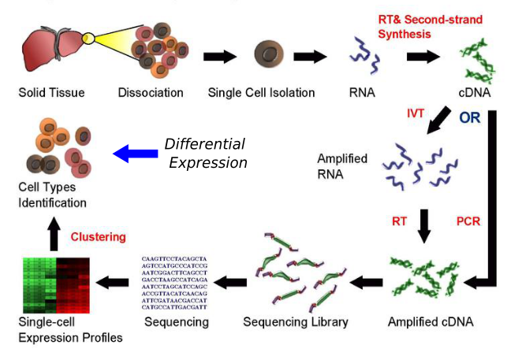

Differential expression: introduction
================

## Content overview

  - Introduction
  - Common methods
  - Methods performance and evaluation
  - Practicalities

-----

## Learning objectives

  - define differential expression DE
  - identify properties of scRNA-seq data influencing DE
  - assess data distributions

-----

## Defining differential expression

#### What does `differential expression` mean to you?

#### Context

#### DE Definition

  - taking read count data &
  - performing statistical analysis to discover quantitative changes in
    expression levels between experimental groups
  - i.e. to decide whether, for a given gene, an observed difference in
    read counts is significant (greater than what would be expected just
    due to natural random variation)

#### DE is an “old problem”

  - known from bulk RNA-seq and microarray studies
  - in fact building on one of the most common statistical problems, i.e
    comparing groups for statistical differences

#### So why do we need to think about DE?

#### Characteristics of scRNA-seq data

  - high noise levels (technical and biological factors)
  - low library sizes
  - low amount of available mRNAs results in amplification biases and
    “dropout events”
  - 3’ bias, partial coverage and uneven depth (technical)
  - stochastic nature of transcription (biological)
  - multimodality in gene expression; presence of multiple possible cell
    states within a cell population (biological)

##### Example distributions

## [Back to main](../README.md)
