Quality Control
================

Created by: Åsa Björklund

# Overview

#### Quality control of data for filtering cells using Seurat and Scater packages.

In this tutorial we will look at different ways of doing filtering and cell and exploring variablility in the data. 

The first part is using Seurat (<https://satijalab.org/seurat/>) for
visualizing QC-measures and filtering cells. However, we will not go
into depth in how to use the Seurat package as this will be covered in
other tutorials.

The second part will explore the scater package
(<https://bioconductor.org/packages/release/bioc/html/scater.html>) in
some more detail. Looking at different ways of visualizing QC-stats and
exploring variation in the data.

### Load the environment
Please follow [these instructions](https://nbisweden.github.io/excelerate-scRNAseq/computing_environment_instructions.html) if to load the conda environment before running the code below.

### Dataset

For this tutorial we will use 3 different PBMC datasets from the 10x
Genomics website
(<https://support.10xgenomics.com/single-cell-gene-expression/datasets>).

  - 1k PBMCs using 10x v2 chemistry
  - 1k PBMCs using 10x v3 chemistry
  - 1k PBMCs using 10x v3 chemistry in combination with cell surface
    proteins, but disregarding the protein data and only looking at gene
    expression.
    
The datasets are available on the classroom computers at ~/scrna-seq2019/day1/1-qc/. If you want to access them after the course you can download them using the following commands:

    cd data
    curl -O http://cf.10xgenomics.com/samples/cell-exp/3.0.0/pbmc_1k_v2/pbmc_1k_v2_filtered_feature_bc_matrix.h5
    curl -O http://cf.10xgenomics.com/samples/cell-exp/3.0.0/pbmc_1k_v3/pbmc_1k_v3_filtered_feature_bc_matrix.h5
    curl -O http://cf.10xgenomics.com/samples/cell-exp/3.0.0/pbmc_1k_protein_v3/pbmc_1k_protein_v3_filtered_feature_bc_matrix.h5

Load required packages:

``` r
suppressMessages(require(Seurat))
suppressMessages(require(scater))
suppressMessages(require(Matrix))
```

#### Read data

Here, we use the function Read10X\_h5 to read in the expression matrices in R.

``` r
v3.1k <- Read10X_h5("~/scrna-seq2019/day1/1-qc/pbmc_1k_v3_filtered_feature_bc_matrix.h5", use.names = T)
v2.1k <- Read10X_h5("~/scrna-seq2019/day1/1-qc/pbmc_1k_v2_filtered_feature_bc_matrix.h5", use.names = T)
p3.1k <- Read10X_h5("~/scrna-seq2019/day1/1-qc/pbmc_1k_protein_v3_filtered_feature_bc_matrix.h5", use.names = T)
```

    ## Genome matrix has multiple modalities, returning a list of matrices for this genome

``` r
# select only gene expression data from the CITE-seq data.
p3.1k <- p3.1k$`Gene Expression`
```

# Seurat

### Create Seurat object

First, create Seurat objects for each of the datasets, and then merge
into one large seurat object.

``` r
sdata.v2.1k <- CreateSeuratObject(v2.1k, project = "v2.1k")
sdata.v3.1k <- CreateSeuratObject(v3.1k, project = "v3.1k")
sdata.p3.1k <- CreateSeuratObject(p3.1k, project = "p3.1k")

# merge into one single seurat object. Add cell ids just in case you have overlapping barcodes between the datasets.
alldata <- merge(sdata.v2.1k, c(sdata.v3.1k,sdata.p3.1k), add.cell.ids=c("v2.1k","v3.1k","p3.1k"))

# also add in a metadata column that indicates v2 vs v3 chemistry
chemistry <- rep("v3",ncol(alldata))
chemistry[Idents(alldata) == "v2.1k"] <- "v2"
alldata <- AddMetaData(alldata, chemistry, col.name = "Chemistry")
alldata
```

    ## An object of class Seurat 
    ## 33538 features across 2931 samples within 1 assay 
    ## Active assay: RNA (33538 features)

``` r
# check number of cells from each sample, is stored in the orig.ident slot of metadata and is autmatically set as active ident.
table(Idents(alldata))
```

    ## 
    ## p3.1k v2.1k v3.1k 
    ##   713   996  1222

#### Calculate mitochondrial proportion

Seurat automatically calculates some QC-stats, like number of UMIs and
features per cell. Stored in columns nCount\_RNA & nFeature\_RNA of the
metadata.

``` r
head(alldata@meta.data)
```

    ##                          orig.ident nCount_RNA nFeature_RNA Chemistry
    ## v2.1k_AAACCTGAGCGCTCCA-1      v2.1k       6631         2029        v2
    ## v2.1k_AAACCTGGTGATAAAC-1      v2.1k       2196          881        v2
    ## v2.1k_AAACGGGGTTTGTGTG-1      v2.1k       2700          791        v2
    ## v2.1k_AAAGATGAGTACTTGC-1      v2.1k       3551         1183        v2
    ## v2.1k_AAAGCAAGTCTCTTAT-1      v2.1k       3080         1333        v2
    ## v2.1k_AAAGCAATCCACGAAT-1      v2.1k       5769         1556        v2

We will manually calculate the proportion of mitochondrial reads and add
to the metadata table.

``` r
mt.genes <- rownames(alldata)[grep("^MT-",rownames(alldata))]
C<-GetAssayData(object = alldata, slot = "counts")

percent.mito <- colSums(C[mt.genes,])/Matrix::colSums(C)*100
alldata <- AddMetaData(alldata, percent.mito, col.name = "percent.mito")
```

#### Calculate ribosomal proportion

In the same manner we will calculate the proportion gene expression that
comes from ribosomal proteins. NOTE - add text on why\!

``` r
rb.genes <- rownames(alldata)[grep("^RP[SL]",rownames(alldata))]
percent.ribo <- colSums(C[rb.genes,])/Matrix::colSums(C)*100
alldata <- AddMetaData(alldata, percent.ribo, col.name = "percent.ribo")
```

### Plot QC

Now we can plot some of the QC-features as violin plots

``` r
VlnPlot(alldata, features = "nFeature_RNA", pt.size = 0.1) + NoLegend()
```

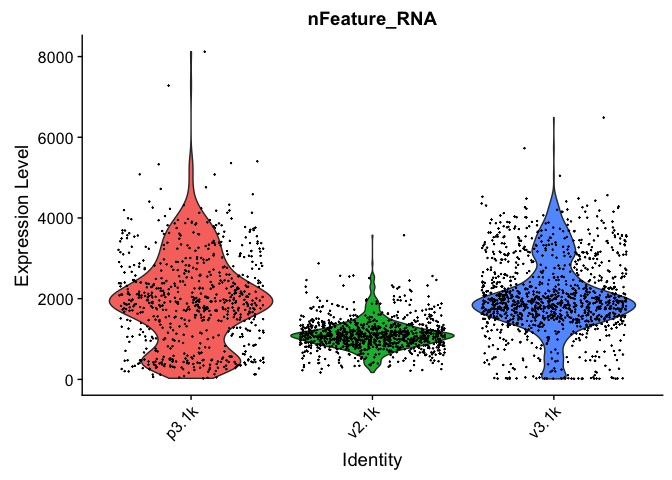

``` r
VlnPlot(alldata, features = "nCount_RNA", pt.size = 0.1) + NoLegend()
```

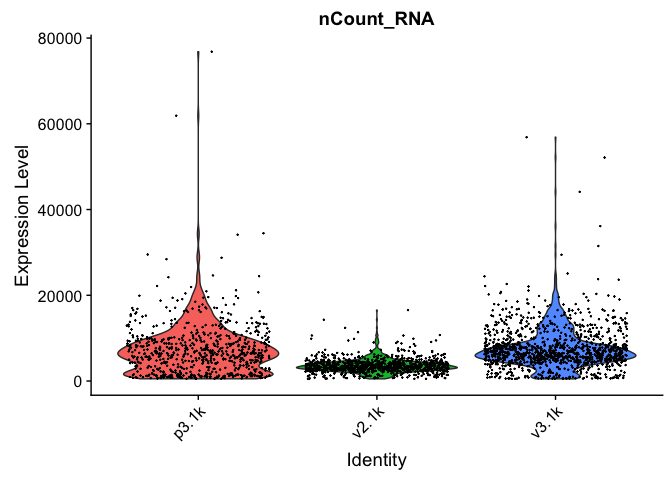

``` r
VlnPlot(alldata, features = "percent.mito", pt.size = 0.1) + NoLegend()
```

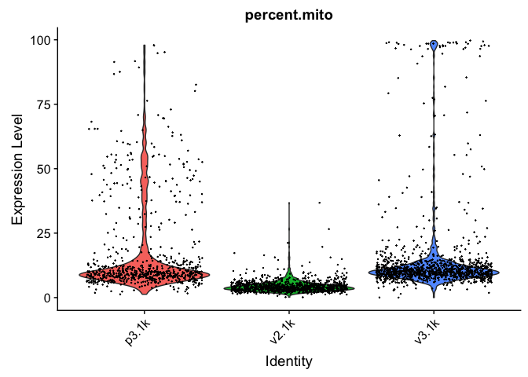

``` r
VlnPlot(alldata, features = "percent.ribo", pt.size = 0.1) + NoLegend()
```


As you can see, the v2 chemistry gives lower gene detection, but higher
detection of ribosomal proteins. As the ribosomal proteins are highly
expressed they will make up a larger proportion of the transcriptional
landscape when fewer of the lowly expressed genes are detected.

And we can plot the different QC-measures as scatter plots

``` r
FeatureScatter(alldata, feature1 = "nCount_RNA", feature2 = "nFeature_RNA")
```


``` r
FeatureScatter(alldata, feature1 = "nFeature_RNA", feature2 = "percent.mito")
```

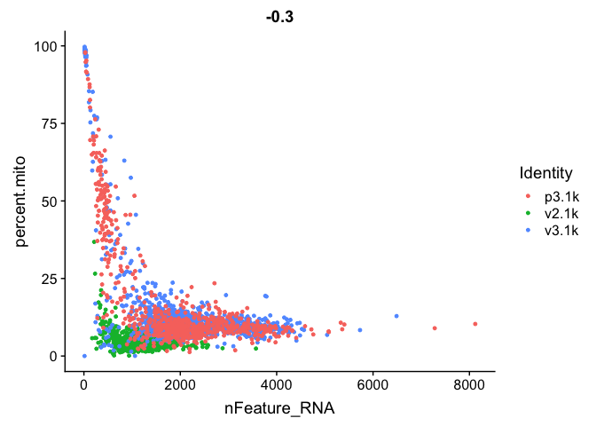

``` r
FeatureScatter(alldata, feature1="percent.ribo", feature2="nFeature_RNA")
```

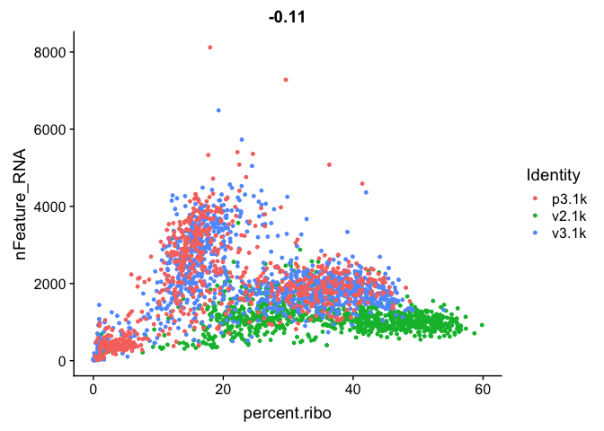

We can also subset the data to only plot one sample.

``` r
FeatureScatter(alldata, feature1 = "nCount_RNA", feature2 = "nFeature_RNA", cells = WhichCells(alldata, expression = orig.ident == "v3.1k") )
```


### Filtering

#### Mitochondrial filtering

We have quite a lot of cells with high proportion of mitochondrial
reads. It could be wise to remove those cells, if we have enough cells
left after filtering. Another option would be to either remove all
mitochondrial reads from the dataset and hope that the remaining genes
still have enough biological signal. A third option would be to just
regress out the percent.mito variable during scaling.

In this case we have as much as 99.7% mitochondrial reads in some of the
cells, so it is quite unlikely that there is much celltype signature
left in those.

Looking at the plots, make resonable decisions on where to draw the
cutoff. In this case, the bulk of the cells are below 25% mitochondrial
reads and that will be used as a cutoff.

``` r
#select cells with percent.mito < 25
selected <- WhichCells(alldata, expression = percent.mito < 25)
length(selected)
```

    ## [1] 2703

``` r
# and subset the object to only keep those cells
data.filt <- subset(alldata, cells = selected)

# plot violins for new data
VlnPlot(data.filt, features = "percent.mito")
```


As you can see, there is still quite a lot of variation in percent mito,
so it will have to be dealt with in the data analysis step.

#### Gene detection filtering

Extremely high number of detected genes could indicate doublets.
However, depending on the celltype composition in your sample, you may
have cells with higher number of genes (and also higher counts) from one
celltype.

In these datasets, there is also a clear difference between the v2 vs v3
10x chemistry with regards to gene detection, so it may not be fair to
apply the same cutoffs to all of them.

Also, in the protein assay data there is a lot of cells with few
detected genes giving a bimodal distribution. This type of distribution
is not seen in the other 2 datasets. Considering that they are all pbmc
datasets it makes sense to regard this distribution as low quality
libraries.

Filter the cells with high gene detection (putative doublets) with
cutoffs 4100 for v3 chemistry and 2000 for v2.

``` r
#start with cells with many genes detected.
high.det.v3 <- WhichCells(data.filt, expression = nFeature_RNA > 4100)
high.det.v2 <- WhichCells(data.filt, expression = nFeature_RNA > 2000 & orig.ident == "v2.1k")

# remove these cells
data.filt <- subset(data.filt, cells=setdiff(WhichCells(data.filt),c(high.det.v2,high.det.v3)))

# check number of cells
ncol(data.filt)
```

    ## [1] 2631

Filter the cells with low gene detection (low quality libraries) with
less than 1000 genes for v2 and \< 500 for v2.

``` r
#start with cells with many genes detected.
low.det.v3 <- WhichCells(data.filt, expression = nFeature_RNA < 1000 & orig.ident != "v2.1k")
low.det.v2 <- WhichCells(data.filt, expression = nFeature_RNA < 500 & orig.ident == "v2.1k")

# remove these cells
data.filt <- subset(data.filt, cells=setdiff(WhichCells(data.filt),c(low.det.v2,low.det.v3)))

# check number of cells
ncol(data.filt)
```

    ## [1] 2531

#### Plot QC-stats again

Lets plot the same qc-stats another time.

``` r
VlnPlot(data.filt, features = "nFeature_RNA", pt.size = 0.1) + NoLegend()
```

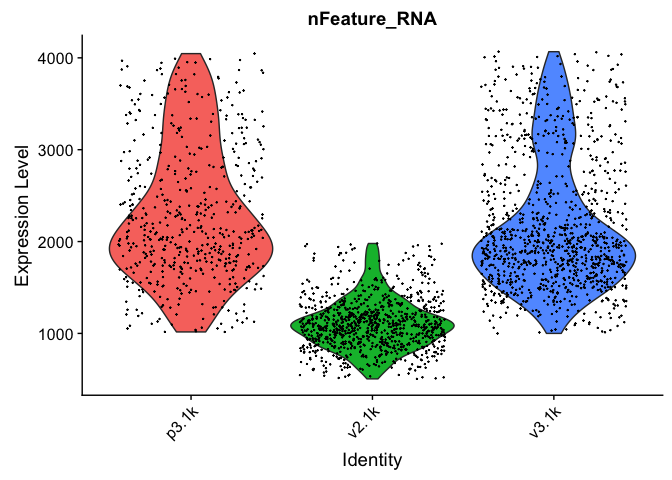

``` r
VlnPlot(data.filt, features = "nCount_RNA", pt.size = 0.1) + NoLegend()
```

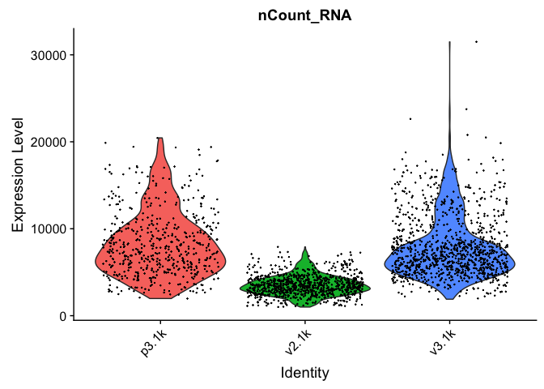

``` r
VlnPlot(data.filt, features = "percent.mito", pt.size = 0.1) + NoLegend()
```

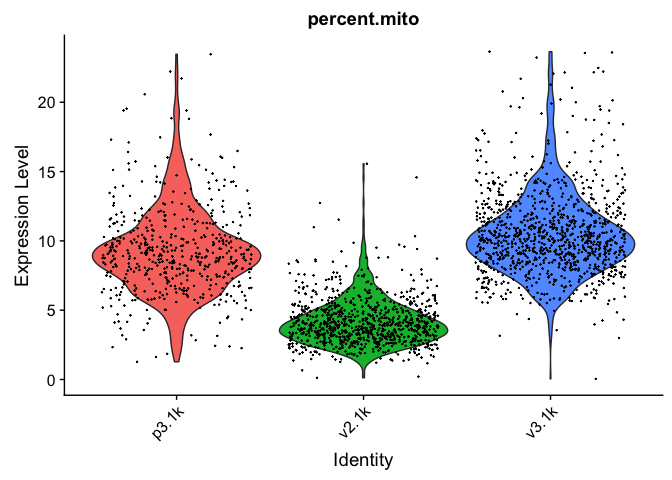

``` r
VlnPlot(data.filt, features = "percent.ribo", pt.size = 0.1) + NoLegend()
```

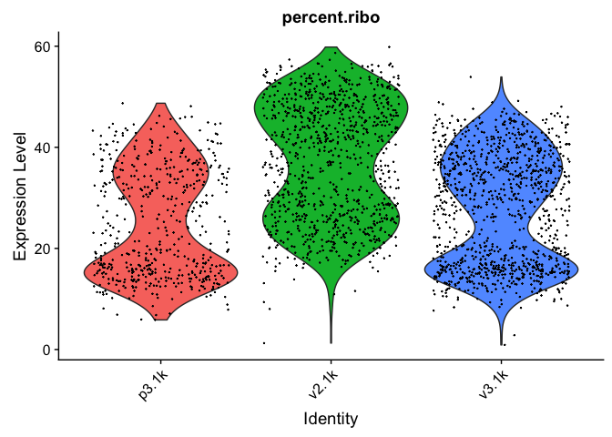

``` r
# and check the number of cells per sample before and after filtering
table(Idents(alldata))
```

    ## 
    ## p3.1k v2.1k v3.1k 
    ##   713   996  1222

``` r
table(Idents(data.filt))
```

    ## 
    ## p3.1k v2.1k v3.1k 
    ##   526   933  1072

### Calculate cell-cycle scores

Seurat has a function for calculating cell cycle scores based on a list
of know S-phase and G2/M-phase genes.

``` r
data.filt <- CellCycleScoring(
  object = data.filt,
  g2m.features = cc.genes$g2m.genes,
  s.features = cc.genes$s.genes
)

VlnPlot(data.filt, features = c("S.Score","G2M.Score"))
```

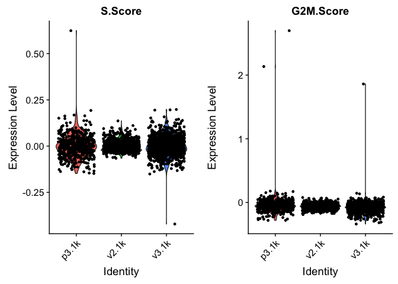

In this case it looks like we only have a few cycling cells in the
datasets.

# Scater

Very similar QC-plots and filtering of cells can be done with the scater
package, but since we alredy filtered cells using Seurat we will now
just use scater to explore technical bias in the data.

You can either create an SCE object directly from the count matrices,
have a look at their tutorial at:
<https://bioconductor.org/packages/release/bioc/vignettes/scater/inst/doc/vignette-intro.html>.

In this case we can convert directly from Seurat to SCE.

``` r
sce <- as.SingleCellExperiment(data.filt)
```

We have accessor functions to access elements of the
SingleCellExperiment object.

  - counts(object): returns the matrix of read counts. As you can see
    above, if no counts are defined for the object, then the counts
    matrix slot is simpy NULL.
  - exprs(object): returns the matrix of (log-counts) expression values,
    in fact accessing the logcounts slot of the object (synonym for
    logcounts).

For convenience (and backwards compatibility with SCESet) getters and
setters are provided as follows: exprs, tpm, cpm, fpkm and versions of
these with the prefix “norm\_”)

The SCE object also has slots for:

  - Cell metadata, which can be supplied as a DataFrame object, where
    rows are cells, and columns are cell attributes (such as cell type,
    culture condition, day captured, etc.).
  - Feature metadata, which can be supplied as a DataFrame object, where
    rows are features (e.g. genes), and columns are feature attributes,
    such as Ensembl ID, biotype, gc content, etc.

### Calculate QC-metrics

By default, the QC metrics are computed from the count data, but this
can be changed through the exprs\_values argument. We can also include
information on which genes are mitochondrial in the function call.

``` r
# calculate all qc-metrics
sce <- calculateQCMetrics(sce, feature_controls = list(mito = mt.genes))

# check what all entries are - 
colnames(colData(sce))
```

    ##  [1] "orig.ident"                                    
    ##  [2] "nCount_RNA"                                    
    ##  [3] "nFeature_RNA"                                  
    ##  [4] "Chemistry"                                     
    ##  [5] "percent.mito"                                  
    ##  [6] "percent.ribo"                                  
    ##  [7] "S.Score"                                       
    ##  [8] "G2M.Score"                                     
    ##  [9] "Phase"                                         
    ## [10] "ident"                                         
    ## [11] "is_cell_control"                               
    ## [12] "total_features_by_counts"                      
    ## [13] "log10_total_features_by_counts"                
    ## [14] "total_counts"                                  
    ## [15] "log10_total_counts"                            
    ## [16] "pct_counts_in_top_50_features"                 
    ## [17] "pct_counts_in_top_100_features"                
    ## [18] "pct_counts_in_top_200_features"                
    ## [19] "pct_counts_in_top_500_features"                
    ## [20] "total_features_by_counts_endogenous"           
    ## [21] "log10_total_features_by_counts_endogenous"     
    ## [22] "total_counts_endogenous"                       
    ## [23] "log10_total_counts_endogenous"                 
    ## [24] "pct_counts_endogenous"                         
    ## [25] "pct_counts_in_top_50_features_endogenous"      
    ## [26] "pct_counts_in_top_100_features_endogenous"     
    ## [27] "pct_counts_in_top_200_features_endogenous"     
    ## [28] "pct_counts_in_top_500_features_endogenous"     
    ## [29] "total_features_by_counts_feature_control"      
    ## [30] "log10_total_features_by_counts_feature_control"
    ## [31] "total_counts_feature_control"                  
    ## [32] "log10_total_counts_feature_control"            
    ## [33] "pct_counts_feature_control"                    
    ## [34] "pct_counts_in_top_50_features_feature_control" 
    ## [35] "pct_counts_in_top_100_features_feature_control"
    ## [36] "pct_counts_in_top_200_features_feature_control"
    ## [37] "pct_counts_in_top_500_features_feature_control"
    ## [38] "total_features_by_counts_mito"                 
    ## [39] "log10_total_features_by_counts_mito"           
    ## [40] "total_counts_mito"                             
    ## [41] "log10_total_counts_mito"                       
    ## [42] "pct_counts_mito"                               
    ## [43] "pct_counts_in_top_50_features_mito"            
    ## [44] "pct_counts_in_top_100_features_mito"           
    ## [45] "pct_counts_in_top_200_features_mito"           
    ## [46] "pct_counts_in_top_500_features_mito"

As you can see, scater calculates quite a few different QC-measures for
the cells.

Scater also calculates some stats based on the genes:

``` r
colnames(rowData(sce))
```

    ## [1] "is_feature_control"      "is_feature_control_mito"
    ## [3] "mean_counts"             "log10_mean_counts"      
    ## [5] "n_cells_by_counts"       "pct_dropout_by_counts"  
    ## [7] "total_counts"            "log10_total_counts"

We will give examples on how to plot some of these.

### Plot QC stats

#### Most expressed features

Let’s look at what the top 50 expressed genes are. This can be valuable
for detecting genes that are overabundant that may be driving a lot of
the variation.

``` r
plotHighestExprs(sce, exprs_values = "counts")
```

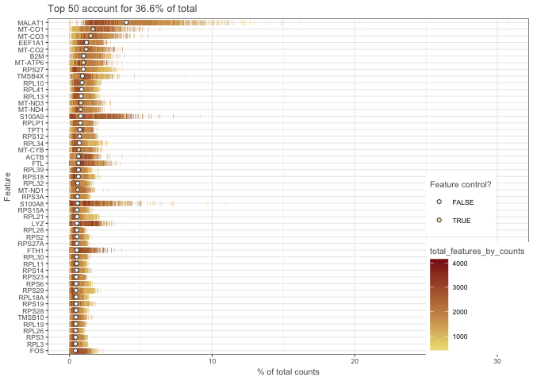

As you can see, MALAT1 corresponds to an average of around 4% of the
counts. And in some cells as high as \~30% of the counts. I would
consider removing that gene before further analysis and clustering.
Also, the mitochondrial genes correspond to a high proportion of the
total counts and should probably be removed.

#### Cumulative expression

Plot the relative proportion of the library size that is accounted for
by the most highly expressed features for each cell (default 500 genes).
This can help us look for differences in expression distributions
between samples.

``` r
# plot each sample separately
plotScater(sce, block1 = "ident", nfeatures = 1000)
```

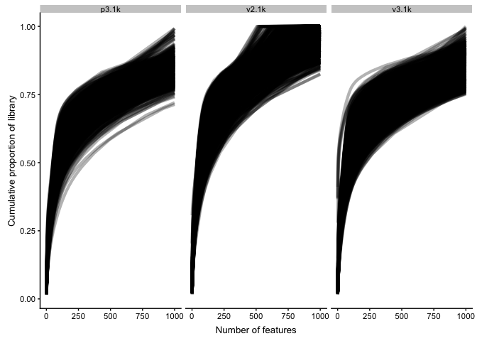

#### Plot gene stats

The function plotRowData can plot any of the stats in rowData, for
instance mean expression vs number of cells with detection.

``` r
plotRowData(sce, x = "n_cells_by_counts", y = "mean_counts")
```

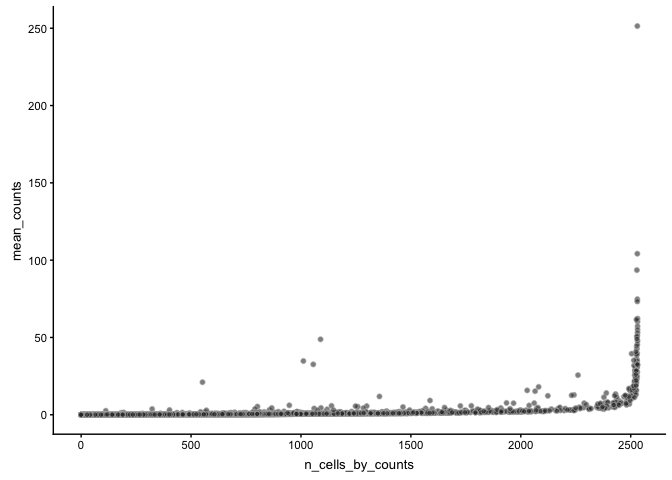

#### Plot cell stats

In the same manner plotColData can plot any of the qc-measures for
cells.

``` r
p1 <- plotColData(sce, x = "total_counts", 
    y = "total_features_by_counts", colour_by = "ident")
p2 <- plotColData(sce, x = "pct_counts_feature_control",
    y = "total_features_by_counts", colour_by = "ident")
p3 <- plotColData(sce, x = "pct_counts_feature_control",
    y = "pct_counts_in_top_50_features", colour_by = "ident")
multiplot(p1, p2, p3, cols = 2)
```

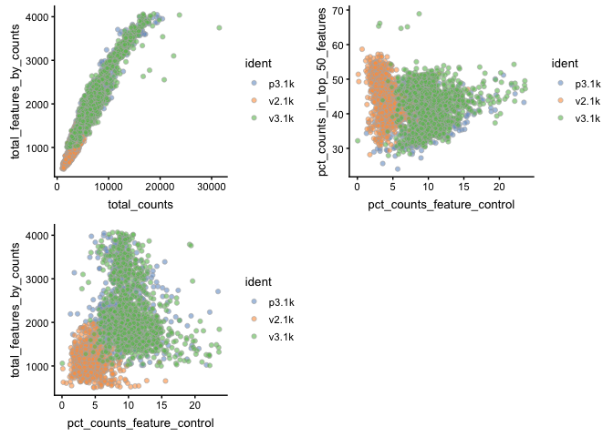

#### Identify outliers in QC-stats

On method of identifying low quality cells is to run PCA on all the
qc-stats and then identify outliers in PCA space.

``` r
sce <- runPCA(sce, use_coldata = TRUE,
    detect_outliers = TRUE)
```

    ## sROC 0.1-2 loaded

``` r
plotReducedDim(sce, use_dimred="PCA_coldata", colour_by = "ident")
```

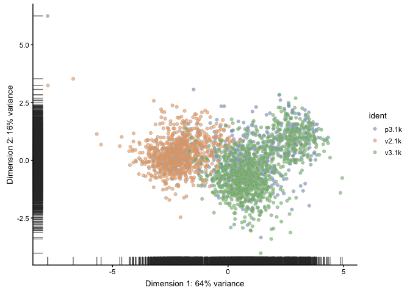

``` r
# check if we have any outliers
table(colData(sce)$outlier)
```

    ## 
    ## FALSE 
    ##  2531

In this case we already filtered out low quality cells and we do not
detect any outliers in the QC PCA.

### Dimensionality reduction

Plot the cells in reduced space and define color/shape/size by different
qc-metrics or meta-data entries.

It is adviced to first run functions like `runPCA`, `runTSNE` etc before
hand so that they are stored in the SCE object, so that there is no need
to rerun those functions each time that you are plotting.

The reduced dimensions can either be plotted with functions like
`plotPCA`, `plotTSNE` etc. Or with the fucntion `plotReducedDim` and
specifying `use_dimred = "pca"` or similar.

OBS\! Before running any dimensionality reduction with a random
component, remeber to set the seed so that you can reproduce the exact
same

Also, some of these dimensionality reduction functions requires
installation of additional R packages.

Note\! You can also run PCA/tSNE etc in Seurat and they will
automatically be imported into the SCE object.

``` r
# run PCA with 1000 top variable genes
sce <- runPCA(sce, ntop = 1000, exprs_values = "logcounts", ncomponents = 20)

# PCA - with different coloring, first 4 components
# first by sample
plotPCA(sce,ncomponents=4,colour_by="ident")
```

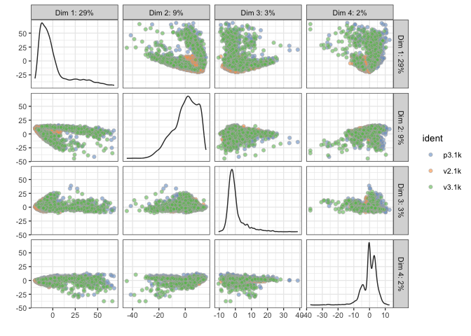

``` r
# then by Celltype
plotPCA(sce,ncomponents=4,colour_by="percent.mito")
```


``` r
# Diffusion map, OBS! Requires installation of package destiny to run!
set.seed(1)
sce <- runDiffusionMap(sce, ntop = 1000, ncomponents = 4)
plotDiffusionMap(sce, colour_by="ident",ncomponents=4)
```

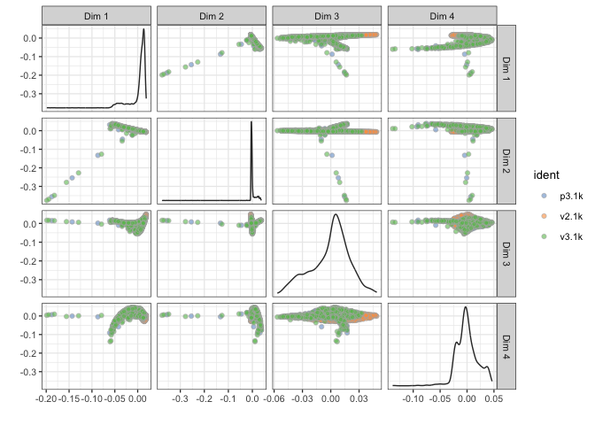

``` r
# tSNE - uses Rtsne function to run tsne, here run with first 10 PCs
set.seed(1)
sce <- runTSNE(sce, ntop = 1000, ncomponents = 2, perplexity = 30, n_dimred = 10)
plotTSNE(sce, colour_by="ident")
```

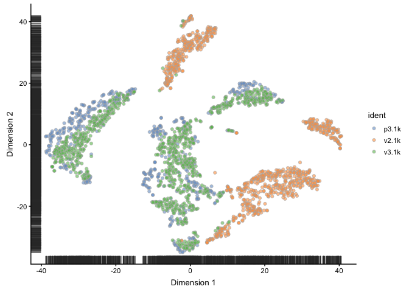

``` r
# UMAP, OBS! Requires installation of package umap to run!
set.seed(1)
sce <- runUMAP(sce)
plotUMAP(object = sce, colour_by="ident")
```

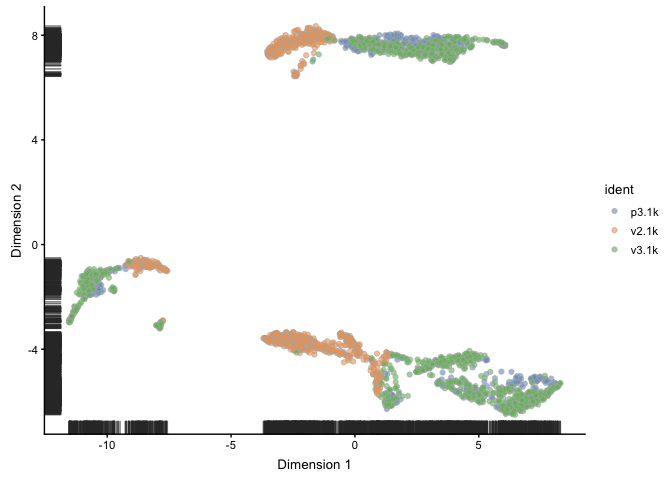

### Explanatory factors

We can check how much of different factors - like different metadata
(e.g samples, timepoints, treatments etc.) or different QC-metrics,

We can investigate the relative importance of different explanatory
factors with the plotExplanatoryVariables function. We compute the R2
for each factor in colData(sce) when fitting a linear model regressing
expression values for each gene against that factor. This is best done
on the log-expression values to reduce the effect of the mean on the
variance - hence, we run normalize first.

By default top 10 factors are plotted, but here we select some specific
factors.

OBS\! This takes a while to calculate and plot.

``` r
plotExplanatoryVariables(sce, variables =  c("ident","Chemistry","pct_counts_mito", "total_features_by_counts", "pct_counts_in_top_50_features", "pct_counts_in_top_500_features", "total_counts", "S.Score","G2M.Score"))
```

    ## Warning: Removed 126585 rows containing non-finite values (stat_density).

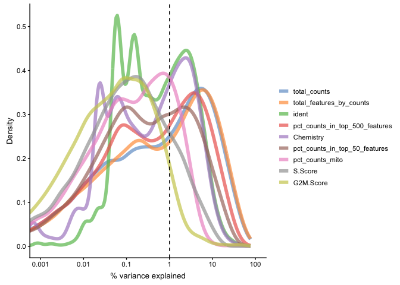

Each line corresponds to one factor and represents the distribution of
R-squared values across all genes.

Identify PCs that correlate strongly to certain QC or Meta-data values.
By default top 10 factors are plotted, but here we select some specific
factors.

``` r
# for total_features
plotExplanatoryPCs(sce, variables = c("ident", "Chemistry","pct_counts_mito", "total_features_by_counts", "pct_counts_in_top_50_features", "total_counts","S.Score","G2M.Score"), npcs_to_plot = 20)
```


Question: Do you think that you can see some clear batch effects in the
data? Do you think that there are any technical biases?

PC1 clearly correlates to the distribution of the data, e.g. the
proportion of counts in top 50-500 highly expressed genes, and also to
total\_features/total\_counts. Which is a common problem in scRNAseq
data. This may be a technical artifact, or a biological features of
celltypes with very different sizes and transcriptional landscape..

It is also clear that many of the top PCs (especially PCs 2,3,6,7,8) are
largely explained by the different samples (ident) or just by v2 vs v3
(Chemistry).

### Session info

``` r
sessionInfo()
```

    ## R version 3.5.1 (2018-07-02)
    ## Platform: x86_64-apple-darwin13.4.0 (64-bit)
    ## Running under: macOS  10.14.4
    ## 
    ## Matrix products: default
    ## BLAS/LAPACK: /Users/asbj/Programs/miniconda3_4.2.12/envs/elixir-course/lib/R/lib/libRblas.dylib
    ## 
    ## locale:
    ## [1] en_US.UTF-8/en_US.UTF-8/en_US.UTF-8/C/en_US.UTF-8/en_US.UTF-8
    ## 
    ## attached base packages:
    ## [1] parallel  stats4    stats     graphics  grDevices utils     datasets 
    ## [8] methods   base     
    ## 
    ## other attached packages:
    ##  [1] Matrix_1.2-17               scater_1.10.1              
    ##  [3] ggplot2_3.1.1               SingleCellExperiment_1.4.0 
    ##  [5] SummarizedExperiment_1.12.0 DelayedArray_0.8.0         
    ##  [7] BiocParallel_1.16.6         matrixStats_0.54.0         
    ##  [9] Biobase_2.42.0              GenomicRanges_1.34.0       
    ## [11] GenomeInfoDb_1.18.1         IRanges_2.16.0             
    ## [13] S4Vectors_0.20.1            BiocGenerics_0.28.0        
    ## [15] Seurat_3.0.0               
    ## 
    ## loaded via a namespace (and not attached):
    ##   [1] reticulate_1.12          R.utils_2.8.0           
    ##   [3] tidyselect_0.2.5         htmlwidgets_1.3         
    ##   [5] grid_3.5.1               trimcluster_0.1-2.1     
    ##   [7] ranger_0.11.1            Rtsne_0.15              
    ##   [9] munsell_0.5.0            destiny_2.12.0          
    ##  [11] codetools_0.2-16         ica_1.0-2               
    ##  [13] umap_0.2.0.0             future_1.12.0           
    ##  [15] sROC_0.1-2               withr_2.1.2             
    ##  [17] colorspace_1.4-1         knitr_1.20              
    ##  [19] ROCR_1.0-7               robustbase_0.93-2       
    ##  [21] vcd_1.4-4                VIM_4.8.0               
    ##  [23] TTR_0.23-4               gbRd_0.4-11             
    ##  [25] listenv_0.7.0            Rdpack_0.10-1           
    ##  [27] labeling_0.3             GenomeInfoDbData_1.2.1  
    ##  [29] cvTools_0.3.2            bit64_0.9-7             
    ##  [31] rhdf5_2.26.2             ggthemes_4.1.1          
    ##  [33] diptest_0.75-7           R6_2.4.0                
    ##  [35] ggbeeswarm_0.6.0         robCompositions_2.0.10  
    ##  [37] rsvd_1.0.0               RcppEigen_0.3.3.5.0     
    ##  [39] mvoutlier_2.0.9          hdf5r_1.2.0             
    ##  [41] flexmix_2.3-15           bitops_1.0-6            
    ##  [43] reshape_0.8.8            assertthat_0.2.1        
    ##  [45] SDMTools_1.1-221.1       scales_1.0.0            
    ##  [47] nnet_7.3-12              beeswarm_0.2.3          
    ##  [49] gtable_0.3.0             npsurv_0.4-0            
    ##  [51] globals_0.12.4           rlang_0.3.4             
    ##  [53] scatterplot3d_0.3-41     splines_3.5.1           
    ##  [55] lazyeval_0.2.2           yaml_2.2.0              
    ##  [57] reshape2_1.4.3           abind_1.4-5             
    ##  [59] tools_3.5.1              zCompositions_1.2.0     
    ##  [61] gplots_3.0.1.1           RColorBrewer_1.1-2      
    ##  [63] proxy_0.4-22             ggridges_0.5.1          
    ##  [65] Rcpp_1.0.1               plyr_1.8.4              
    ##  [67] zlibbioc_1.28.0          purrr_0.3.2             
    ##  [69] RCurl_1.95-4.12          pbapply_1.4-0           
    ##  [71] viridis_0.5.1            cowplot_0.9.4           
    ##  [73] zoo_1.8-5                haven_2.1.0             
    ##  [75] ggrepel_0.8.1            cluster_2.0.9           
    ##  [77] magrittr_1.5             RSpectra_0.14-0         
    ##  [79] data.table_1.12.2        openxlsx_4.1.0          
    ##  [81] lmtest_0.9-36            RANN_2.6                
    ##  [83] truncnorm_1.0-8          mvtnorm_1.0-10          
    ##  [85] fitdistrplus_1.0-14      hms_0.4.2               
    ##  [87] lsei_1.2-0               evaluate_0.13           
    ##  [89] smoother_1.1             rio_0.5.16              
    ##  [91] mclust_5.4.3             readxl_1.3.1            
    ##  [93] gridExtra_2.3            compiler_3.5.1          
    ##  [95] tibble_2.1.1             KernSmooth_2.23-15      
    ##  [97] crayon_1.3.4             R.oo_1.22.0             
    ##  [99] htmltools_0.3.6          pcaPP_1.9-73            
    ## [101] tidyr_0.8.3              rrcov_1.4-4             
    ## [103] MASS_7.3-51.4            fpc_2.1-11.1            
    ## [105] boot_1.3-22              car_3.0-2               
    ## [107] sgeostat_1.0-27          R.methodsS3_1.7.1       
    ## [109] gdata_2.18.0             metap_1.1               
    ## [111] igraph_1.2.4.1           forcats_0.4.0           
    ## [113] pkgconfig_2.0.2          foreign_0.8-71          
    ## [115] laeken_0.5.0             sp_1.3-1                
    ## [117] plotly_4.8.0             vipor_0.4.5             
    ## [119] XVector_0.22.0           bibtex_0.4.2            
    ## [121] NADA_1.6-1               stringr_1.4.0           
    ## [123] digest_0.6.18            sctransform_0.2.0       
    ## [125] pls_2.7-0                tsne_0.1-3              
    ## [127] rmarkdown_1.11           cellranger_1.1.0        
    ## [129] DelayedMatrixStats_1.4.0 curl_3.3                
    ## [131] kernlab_0.9-27           gtools_3.8.1            
    ## [133] modeltools_0.2-22        nlme_3.1-139            
    ## [135] jsonlite_1.6             Rhdf5lib_1.4.3          
    ## [137] carData_3.0-2            viridisLite_0.3.0       
    ## [139] pillar_1.3.1             lattice_0.20-38         
    ## [141] GGally_1.4.0             httr_1.4.0              
    ## [143] DEoptimR_1.0-8           survival_2.44-1.1       
    ## [145] xts_0.11-1               glue_1.3.1              
    ## [147] zip_2.0.1                png_0.1-7               
    ## [149] prabclus_2.2-7           bit_1.1-14              
    ## [151] class_7.3-15             stringi_1.4.3           
    ## [153] HDF5Array_1.10.1         caTools_1.17.1.2        
    ## [155] dplyr_0.8.0.1            irlba_2.3.3             
    ## [157] e1071_1.7-0              future.apply_1.1.0      
    ## [159] ape_5.3
